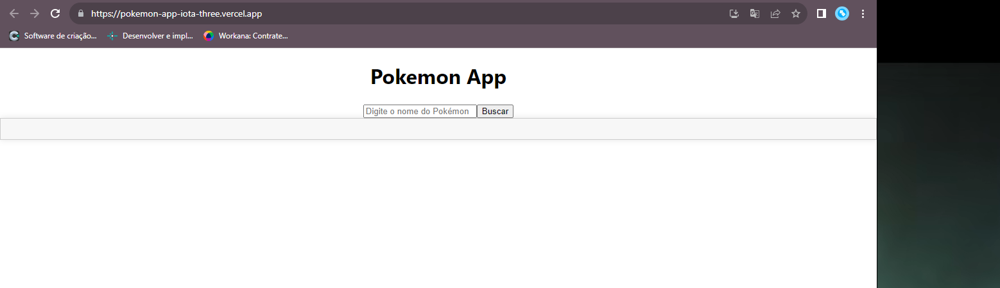

# Pokemon Search App

## Descrição

Este é um projeto de aplicação web em React que permite aos usuários buscar informações sobre Pokemon digitando o nome do Pokemon desejado.

## Tecnologias Utilizadas

- **React:** Utilizamos o React como biblioteca principal para criar a interface do usuário.

- **Axios:** Utilizamos o Axios para fazer requisições à API da PokeAPI para obter dados sobre os Pokémon.

- **CSS:** Utilizamos folhas de estilo CSS para a aparência e layout da aplicação.

## Funcionalidades

### 1. Busca de Pokemon

- Os usuários podem digitar o nome de um Pokemon na barra de pesquisa.

- Pressionar "Enter" para buscar informações sobre o Pokemon.

### 2. Exibição de Informações

- Após a busca, as informações do Pokémon, como nome, tipo, imagem, e outras informações relevantes, são exibidas na tela.

## Como Executar Localmente

Siga estas etapas para executar a aplicação em seu ambiente de desenvolvimento:

### Passo 1: Clone o Repositório

Clone este repositório para o seu computador:

`bash`
git clone https://github.com/vinicius-souzat/pokemon-app.git

### Passo 2: Navegue até a pasta do projeto
`cd` pokemon-app

### Passo 3: Instale as dependências
`npm` install

### Passo 4: Inicie a Aplicação
`npm` start

A aplicação será aberta no seu navegador padrão. Você pode acessá-la em http://localhost:3000.

## Hospedagem

A aplicação está hospedada em [https://pokemon-app-iota-three.vercel.app/](https://pokemon-app-iota-three.vercel.app/).

## Licença

Este projeto está licenciado sob a Licença MIT. Consulte o arquivo LICENSE para obter detalhes.
